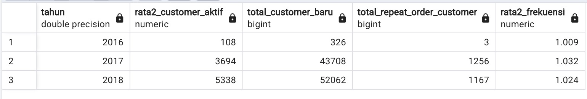
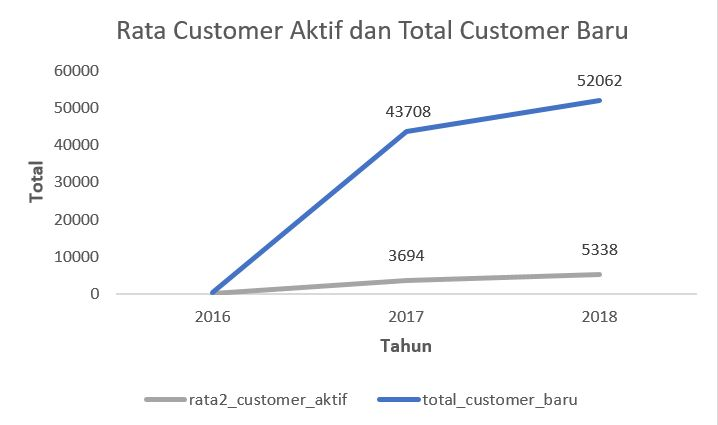

#  **Analyzing E-Commerce Business Performance with SQL**
<br>

**Tools** : PostgreSQL <br> 
**Visualization** : Microsoft Excel <br>
**Dataset** : Rakamin Academy - [Ecommerce Data](https://github.com/RifkiOskar/Analyzing-eCommerce-Business-Performance-with-SQL/tree/master/csv)
<br>
<br>
**Table of Contents**
- [Problem Statement](https://github.com/RifkiOskar/Analyzing-eCommerce-Business-Performance-with-SQL/blob/master/README.md#-problem-statement)
	- [Background Story](https://github.com/RifkiOskar/Analyzing-eCommerce-Business-Performance-with-SQL/blob/master/README.md#background-story)
	- [Objective](https://github.com/RifkiOskar/Analyzing-eCommerce-Business-Performance-with-SQL/blob/master/README.md#objective)
- [Data Preparation](https://github.com/RifkiOskar/Analyzing-eCommerce-Business-Performance-with-SQL/blob/master/README.md#-data-preparation)
	- [Create Database and ERD](https://github.com/RifkiOskar/Analyzing-eCommerce-Business-Performance-with-SQL/blob/master/README.md#create-database-and-erd)
- [Data Analysis](https://github.com/RifkiOskar/Analyzing-eCommerce-Business-Performance-with-SQL/blob/master/README.md#-data-preparation)
	- [Annual Customer Activity Growth](https://github.com/RifkiOskar/Analyzing-eCommerce-Business-Performance-with-SQL/tree/master#1-annual-customer-activity-growth)
<br>

## 📂 **Problem Statement**

### **Background Story**
Mengukur performa bisnis merupakan suatu hal yang sangat penting bagi sebuah perusahaan. Ini akan membantu dalam memantau, dan menilai keberhasilan atau kegagalan dari berbagai proses bisnis. Pengukuran performa bisnis dapat dilakukan dengan memperhitungkan beberapa metrik bisnis. Dalam poyek ini akan dilakukan analisis performa bisnis suatu perusahaan eCommerce dengan dengan metrik bisnis yaitu pertumbuhan pelanggan, kualitas produk, dan tipe pembayaran berdasarkan historical data selama tiga tahun.

### **Objective**
Mengumpulkan insight dari analisis dan dengan visualisasi berupa :
1. **Annual Customer Activity Growth**
2. **Annual Product Category Quality**
3. **Annual Payment Type Usage**
<br>

## 📂 **Data Preparation**

Dataset yang digunakan adalah dataset sebuah perusahaan eCommerce Brasil yang memiliki informasi pesanan dengan jumlah 99441 dari tahun 2016 hingga 2018. Terdapat fitur-titur yang membuat informasi seperti status pemesanan, lokasi, rincian item, jenis pembayaran, serta ulasan.

### **Create Database and ERD**
**Langkah-langkah yang dilakukan meliputi:**
1. Membuat workspace database di dalam pgAdmin dan membuat tabel menggunakan `CREATE TABLE` statement
2. Melakukan import data csv kedalam database
3. Menentukan Primary Key atau Foreign Key enggunakan statement `ALTER TABLE`
4. Membuat dan mengeksport ERD (Entity Relationship Diagram) <br>

<details>
  <summary>Click untuk melihat Queries</summary>
  
  ```sql
-- Buat databases dengan cara click kanan databases -> create -> databases -> isi nama db.
-- Setelah databases sudah dibuat dan mau generate csv ke sql, lakukan create table terlebih dahulu.
-- By GUI untuk membuat table dengan cara click dropdown schema -> click kanan table -> create table.

-- By SQL dengan cara sebagai berikut dengan mengikuti kolom yang ada difile csv.
CREATE TABLE product_dataset (
	product_id VARCHAR,
	product_category_name VARCHAR,
	product_name_length FLOAT,
	product_description_length FLOAT,
	product_photos_qty FLOAT,
	product_weight_g FLOAT,
	product_length_cm FLOAT,
	product_height_cm FLOAT,
	product_width_cm FLOAT
);

CREATE TABLE geolocation_dataset (
	geolocation_zip_code_prefix VARCHAR,
	geolocation_lat FLOAT,
	geolocation_lng FLOAT,
	geolocation_city VARCHAR,
	geolocation_state VARCHAR
);

CREATE TABLE customers_dataset (
	customer_id VARCHAR,
	customer_unique_id VARCHAR,
	customer_zip_code_prefix VARCHAR,
	customer_city VARCHAR,
	customer_state VARCHAR
);

CREATE TABLE sellers_dataset (
	seller_id VARCHAR,
	seller_zip_code_prefix VARCHAR,
	seller_city VARCHAR,
	seller_state VARCHAR
);

CREATE TABLE orders_dataset (
	order_id VARCHAR,
	customer_id VARCHAR,
	order_status VARCHAR,
	order_purchase_timestamp TIMESTAMP,
	order_approved_at TIMESTAMP,
	order_delivered_carrier_date TIMESTAMP,
	order_delivered_customer_date TIMESTAMP,
	order_estimated_delivery_date TIMESTAMP
);

CREATE TABLE order_reviews_dataset (
	review_id VARCHAR,
	order_id VARCHAR,
	review_score INT,
	review_comment_title VARCHAR,
	review_comment_message VARCHAR,
	review_creation_date TIMESTAMP,
	review_answer_date TIMESTAMP
);

CREATE TABLE order_payments_dataset (
	order_id VARCHAR,
	payment_sequential INT,
	payment_type VARCHAR,
	payment_installments INT,
	payment_value FLOAT
);

CREATE TABLE order_items_dataset (
	order_id VARCHAR,
	order_item_id INT,
	product_id VARCHAR,
	seller_id VARCHAR,
	shipping_limit_date TIMESTAMP,
	price FLOAT,
	freight_value FLOAT
);

-- MEMBUAT PRIMARY KEY PADA SETIAP TABLE
ALTER TABLE product_dataset ADD CONSTRAINT product_dataset_pkey PRIMARY KEY(product_id);
ALTER TABLE customers_dataset ADD CONSTRAINT customer_dataset_pkey PRIMARY KEY(customer_id);
ALTER TABLE sellers_dataset ADD CONSTRAINT seller_dataset_pkey PRIMARY KEY(seller_id);
ALTER TABLE orders_dataset ADD CONSTRAINT order_dataset_pkey PRIMARY KEY(order_id);
-- TABLE geolocation_dataset tidak bisa primary key untuk kolom zip_code, karna terdapat double data

-- MEMBUAT FOREIGN KEY UNTUK RELASI ANTAR TABLE
ALTER TABLE order_items_dataset ADD FOREIGN KEY (order_id) REFERENCES orders_dataset;
ALTER TABLE order_items_dataset ADD FOREIGN KEY (product_id) REFERENCES product_dataset;
ALTER TABLE order_items_dataset ADD FOREIGN KEY (seller_id) REFERENCES sellers_dataset;
ALTER TABLE order_reviews_dataset ADD FOREIGN KEY (order_id) REFERENCES orders_dataset;
ALTER TABLE order_payments_dataset ADD FOREIGN KEY (order_id) REFERENCES orders_dataset;
ALTER TABLE orders_dataset ADD FOREIGN KEY (customer_id) REFERENCES customers_dataset;

-- KEMUDIAN BUAT ERD DENGAN CARA CLICK KANAN DATABASES -> ERD FOR DATABASES
```
</details>

**Hasil ERD**:
<br>
<p align="center">
  <kbd> </kbd> <br>
  Gambar 1. Entity Relationship Diagram
</p>
<br>
<br>

## 📂 **Data Analysis**

### **1. Annual Customer Activity Growth**
Pertumbuhan aktivitas pelanggan tahunan dapat dianalisis dari Monthly active user (MAU), pelanggan baru, pelanggan dengan repeat order, dan rata-rata order oleh pelanggan.

<details>
  <summary>Click untuk melihat Queries</summary>
  
  ```sql
 WITH monthly_active_user AS (
	SELECT 
	tahun, 
	FLOOR(avg(customer_total)) as rata2_customer_aktif
FROM (
		SELECT
			date_part('year', od.order_purchase_timestamp) AS tahun,
			date_part('month', od.order_purchase_timestamp) AS bulan,
			COUNT(DISTINCT cd.customer_unique_id) AS customer_total
		FROM
			orders_dataset AS od
		JOIN
			customers_dataset AS cd
		ON
			od.customer_id = cd.customer_id
		GROUP BY tahun, bulan
	) AS tmp
GROUP BY tahun
),

total_new_customer AS(
	SELECT 
	date_part('year', pembelian_pertama) AS tahun,
	count(customer) AS total_customer_baru
FROM (
		SELECT
			cd.customer_unique_id AS customer,
			MIN(od.order_purchase_timestamp) AS pembelian_pertama
		FROM 
			customers_dataset AS cd
		JOIN 
			orders_dataset AS OD
		ON
			cd.customer_id = od.customer_id
		GROUP BY customer
	) AS tmp
GROUP BY tahun
ORDER BY tahun
),

repeat_order AS (
	SELECT 
	tahun, 
	COUNT(customer) AS total_repeat_order_customer
FROM(
		SELECT
			date_part('year', od.order_purchase_timestamp) AS tahun,
			cd.customer_unique_id AS customer,
			COUNT(od.order_id) AS total_order
		FROM 
			orders_dataset AS od
		JOIN
			customers_dataset as cd
		ON
			od.customer_id = cd.customer_id
		GROUP BY tahun, customer
		HAVING COUNT(od.order_id) > 1
	)tmp
GROUP BY tahun
ORDER BY tahun
),

freq_order AS (
	SELECT
	tahun,
	ROUND(AVG(freq),3) AS rata2_frekuensi
FROM(
		SELECT 
			date_part('year', od.order_purchase_timestamp) AS tahun,
			cd.customer_unique_id as customer,
			COUNT(od.order_id) as freq
		FROM
			orders_dataset as od
		JOIN
			customers_dataset as cd
		ON
			od.customer_id = cd.customer_id
		GROUP BY tahun, customer
	) tmp
GROUP BY tahun
)

SELECT DISTINCT
	mau.tahun,
	mau.rata2_customer_aktif,
	tnc.total_customer_baru,
	ro.total_repeat_order_customer,
	fo.rata2_frekuensi
FROM
	monthly_active_user AS mau
JOIN
	total_new_customer AS tnc ON tnc.tahun = mau.tahun
JOIN
	repeat_order AS ro ON ro.tahun = mau.tahun
JOIN
	freq_order AS fo ON fo.tahun = mau.tahun
  ```
</details>

<p align="center">
Tabel 1. Hasil Analisis Pertumbuhan Aktivitas Pelanggan Tahunan  <br>
  <kbd> </kbd> <br>
</p>

<br>
<p align="center">
  <kbd> </kbd> <br>
  Gambar 2. Grafik Rata-rata Customer Aktif dan Total Customer Baru
</p>

Secara keseluruhan perusahaan mengalami peningkakatan Monthly Active User serta pelanggan baru setiap tahunnya. Peningkatan yang signifikan terjadi pada tahun 2016 ke 2017, hal ini dikarenakan data transaksi pada tahun 2016 dimulai pada bulan September. <br>
<br>
<br>

<p align="center">
  <kbd> </kbd> <br>
  Gambar 3. Grafik Customer yang Melakukan Repeat Order
</p>

Peningkatan yang signifikan juga terjadi pada jumlah pelanggan yang melakukan repeat order pada tahun 2016 hingga 2017. Namun pada tahun 2018 mengalami sedikit penurunan. <br>
<br>
<br>


<p align="center">
  <kbd> </kbd> <br>
  Gambar 4. Grafik Rata-rata Frekuensi Order Pelanggan
</p>

Dari analisis dan grafik diatas dapat diketahui bahwa rata-rata pelanggan setiap tahunnya cenderung hanya melakukan order satu kali, artinya mayoritas pelanggan tidak melakukan repeat order.<br>
<br>
